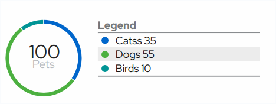
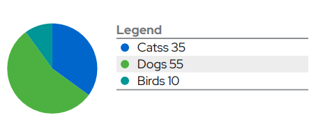
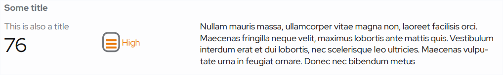
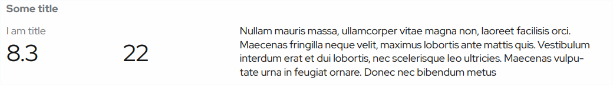
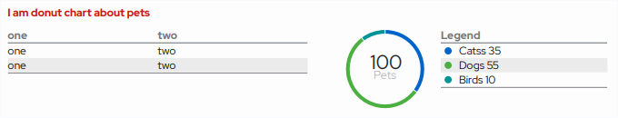
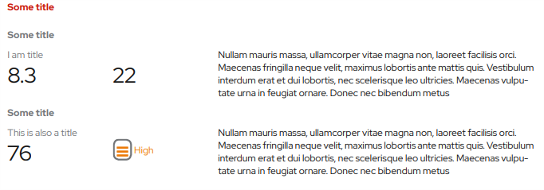
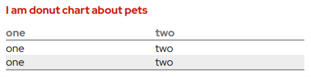
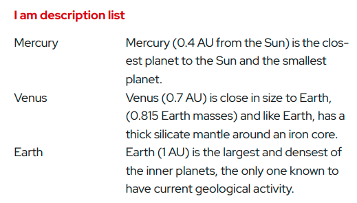

# RedHat Cloud Services frontend components - PDF generator

[](https://badge.fury.io/js/%40redhat-cloud-services%2Ffrontend-components-pdf-generator)

You can use this component in order to create download/preview PDF.


You need to install this package:

```bash
$ npm i -S @redhat-cloud-services/frontend-components-pdf-generator
```

```bash
$ yarn add @redhat-cloud-services/frontend-components-pdf-generator
```

## Usage
This component allows multiple pages to be present in one report, just make sure that each page fits the paper size you are going to use.
```JSX
import React, { Component, Fragment } from 'react';
import ReactDOM from 'react-dom';
import { DownloadButton, Section, Column, Table, Panel, PanelItem, Battery, Chart, Dl, Dt, Dd } from '@redhat-cloud-services/frontend-components-pdf-generator';

class DemoApp extends Component {
    state = {
        cats: 35,
        dogs: 55,
        birds: 10
    }

    render() {
        const { cats, dogs, birds } = this.state;
        return (
            <div className="pf-m-redhat-font">
                <DownloadButton isPreview title={[
                    'Lorem ipsum dolor sit amet, consectetur adipiscing elit. ',
                    { title: 'Something bold ', fontWeight: 700, style: { color: 'red' } },
                    'Nullam mauris massa, ullamcorper vitae magna non, laoreet facilisis orci. Maecenas fringilla neque velit, maximus lobortis ante mattis quis. Vestibulum interdum erat et dui lobortis, nec scelerisque leo ultricies. Maecenas vulputate urna in feugiat ornare. Donec nec bibendum metus'
                ]} pages={[
                    <Fragment key="first-section">
                        <Section title="I am donut chart about pets">
                            <Column>
                                <Table
                                    withHeader
                                    rows={[
                                        [ 'one', 'two' ],
                                        [ 'one', 'two' ],
                                        [ 'one', 'two' ]
                                    ]}
                                />
                            </Column>
                            <Column>
                                <Chart
                                    chartType="donut"
                                    subTitle="Pets"
                                    title="100"
                                    data={[{ x: 'Catss', y: cats }, { x: 'Dogs', y: dogs }, { x: 'Birds', y: birds }]}
                                />
                            </Column>
                        </Section>
                        <Section title="I am pie chart about pets">
                            <Column>
                                <Table
                                    withHeader
                                    rows={[
                                        [ 'one', 'two' ],
                                        [ 'one', 'two' ],
                                        [ 'one', 'two' ]
                                    ]}
                                />
                            </Column>
                            <Column>
                                <Chart
                                    chartType="pie"
                                    subTitle="Pets"
                                    title="100"
                                    data={[{ x: 'Catss', y: cats }, { x: 'Dogs', y: dogs }, { x: 'Birds', y: birds }]}
                                />
                            </Column>
                        </Section>
                        <Section title="I am just a table">
                            <Column>
                                <Table
                                    withHeader
                                    rows={[
                                        [ 'one', 'two' ],
                                        [ 'one', 'two' ],
                                        [ 'one', 'two' ]
                                    ]}
                                />
                            </Column>
                            <Column/>
                        </Section>
                        <Section title="I am description list">
                            <Column>
                                <Dl>
                                    <Dt>Mercury</Dt>
                                    <Dd>Mercury (0.4 AU from the Sun) is the closest planet to the Sun and the smallest planet.</Dd>
                                    <Dt>Venus</Dt>
                                    <Dd>Venus (0.7 AU) is close in size to Earth, (0.815 Earth masses) and like Earth, has a thick silicate mantle around an iron core.</Dd>
                                    <Dt>Earth</Dt>
                                    <Dd>Earth (1 AU) is the largest and densest of the inner planets, the only one known to have current geological activity.</Dd>
                                </Dl>
                            </Column>
                        </Section>
                        <Section title="Some title" withColumn={false}>
                            <Panel title="Some title" description="Nullam mauris massa, ullamcorper vitae magna non, laoreet facilisis orci. Maecenas fringilla neque velit, maximus lobortis ante mattis quis. Vestibulum interdum erat et dui lobortis, nec scelerisque leo ultricies. Maecenas vulputate urna in feugiat ornare. Donec nec bibendum metus">
                                <PanelItem title="I am title">
                                    8.3
                                </PanelItem>
                                <PanelItem>
                                    22
                                </PanelItem>
                            </Panel>
                            <Panel title="Some title" description="Nullam mauris massa, ullamcorper vitae magna non, laoreet facilisis orci. Maecenas fringilla neque velit, maximus lobortis ante mattis quis. Vestibulum interdum erat et dui lobortis, nec scelerisque leo ultricies. Maecenas vulputate urna in feugiat ornare. Donec nec bibendum metus">
                                <PanelItem title="This is also a title">
                                    76
                                </PanelItem>
                                <PanelItem>
                                    <Battery variant="high" />
                                </PanelItem>
                            </Panel>
                        </Section>
                    </Fragment>
                ]}/>
            </div>
        );
    }
}
ReactDOM.render(<DemoApp />, document.querySelector('.demo-app'));
```

### Async data

If you need to load data when user clicks on a button you are free to do so by using `asyncFunction` prop. This function has to return pages in similiar way how pages are applied to this component

```JSX
<DownloadButton asyncFunction={() => (new Promise((res) => {
    setTimeout(() => {
        res({ rows: [ [ 'one', 'two' ] ] });
    }, 1000);
})).then(data => ([
    <Fragment key="first-section">
        <Section title="I am donut chart about pets">
            <Column>
                <Table
                    withHeader
                    rows={data.rows}
                />
            </Column>
        </Section>
    </Fragment>
]))} buttonProps={{
    variant: 'link',
    className: 'some-btn-class'
}} />
```

To properly style and use button that is created in this approach there is `buttonProps` property to which you can pass Patternfly's button config.

### Config
There are mutliple config options derived from [react-pdf](https://react-pdf.org) and here are some that should help you to make PDFs easier.
* `label` - what should be on button for PDF download.
* `fileName` - when user hits download this will be name of file that is downloaded.
* `type` - report type. Combination of this and `reportName` will be shown at each page.
* `reportName` - defaults to `Executive report:`. Title that will be displayed on all pages.
* `isPreview` - this option is applicable only to root component of PDF download and it will enable in page view of PDF.
* `debug` - this option comes directly from react-pdf and it will drap rectangle around element to let you know how much space it is taking (many custom components support this as well)
* `title` - if you want to insert title above some elements many components support it, they have predefined title so correct styling is applied
* `size` - Define page size. if String must be one of the [available sizes by react-pdf](https://github.com/diegomura/react-pdf/blob/master/src/utils/pageSizes.js)
* `orientation` - page orientation, defaults to `'portrait'` but can be changed to `'landscape'`
* styled texts - if you want to style some text place them in array instead of direct string and you can then wrap each part of such text in object
  * `title` - text to render
  * `fontWeight` - either 500 or 700 for normal and bold
  * `fontStyle` - to make the text italic you can pass value `italic` to this prop
  * `fontSize` - if you want change the font size you can pass number value in this prop

### Partials
There are multiple components written and preconfigured for you, if you want to write custom components or use something more sophisticated you can use [react-pdf/components](https://react-pdf.org/components).

#### 1) `Chart`
We are using PF charts as source of truth when rendering charts in PDF. For further prop list and how to use charts please go to [PF Donut chart docs](https://patternfly-react.surge.sh/patternfly-4/documentation/react/charts/chartdonut).

There is `chartType` prop to define which chart should be used:
* `pie`
* `donut`
* `donutUtilization`

If you want to change the color schema for each chart you can do that by passing `colorSchema` prop. These schemas are tied to PF color schemas:
 * `blue`,
 * `cyan`
 * `default`
 * `gold`
 * `gray`
 * `green`
 * `multi`
 * `multiOrdered`
 * `multiUnordered`
 * `orange`
 * `purple`

##### `Donut`
```JSX
import { Chart } from '@redhat-cloud-services/frontend-components-pdf-generator';

<Chart
    chartType="donut"
    subTitle="Pets"
    title="100"
    data={[{ x: 'Catss', y: cats }, { x: 'Dogs', y: dogs }, { x: 'Birds', y: birds }]}
/>
```

##### `Pie`
```JSX
import { Chart } from '@redhat-cloud-services/frontend-components-pdf-generator';

<Chart
    chartType="pie"
    subTitle="Pets"
    title="100"
    data={[{ x: 'Cats', y: cats }, { x: 'Dogs', y: dogs }, { x: 'Birds', y: birds }]}
/>
```


#### 2) `Panel` and `PanelItem`



#### 3) `Section`
  * column type - This component uses flex set to 1 so if you will use section in column type you can insert multiple columns in row.
```JSX
import { Section, Column, customTitle } from '@redhat-cloud-services/frontend-components-pdf-generator';

<Section title="I am donut chart about pets">
    <Column>
        { customTitle(['some', { title: 'text' }]) }
    </Column>
</Section>
```


  * row type - Section by default has column type by default, in order to switch it to row you have to pass `withColumn={false}`
```JSX
import { Section, customTitle } from '@redhat-cloud-services/frontend-components-pdf-generator';

<Section title="Some title" withColumn={false}>
    {customTitle('some text')}
</Section>
```


#### 4) `Table`
Table has by default header turned off, so if you want to treat first row as header you have to specify it in prop
```JSX
import { Section } from '@redhat-cloud-services/frontend-components-pdf-generator';

<Table
    withHeader
    rows={[
        [ 'one', 'two' ],
        [ 'one', 'two' ],
        [ 'one', 'two' ]
    ]}
/>
```

#### 5) `Description List`
All the elements (dl, dt, dd) can be styled individually
```JSX
import { Section } from '@redhat-cloud-services/frontend-components-pdf-generator';

<Dl>
    <Dt>Mercury</Dt>
    <Dd>Mercury (0.4 AU from the Sun) is the closest planet to the Sun and the smallest planet.</Dd>
    <Dt>Venus</Dt>
    <Dd>Venus (0.7 AU) is close in size to Earth, (0.815 Earth masses) and like Earth, has a thick silicate mantle around an iron core.</Dd>
    <Dt>Earth</Dt>
    <Dd>Earth (1 AU) is the largest and densest of the inner planets, the only one known to have current geological activity.</Dd>
</Dl>
```

